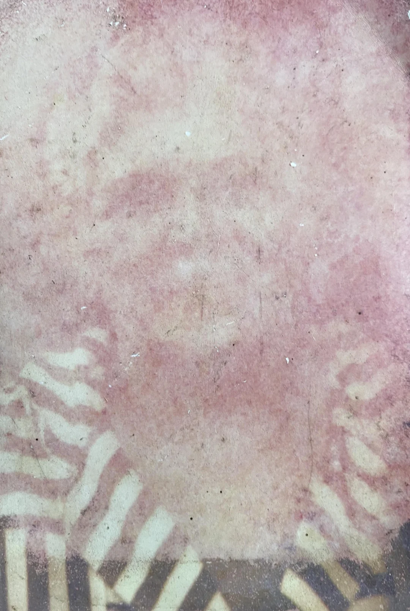
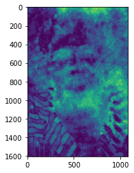
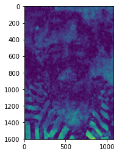
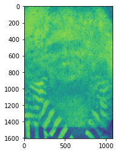
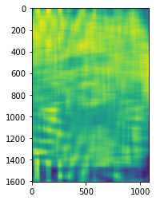
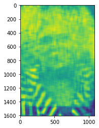
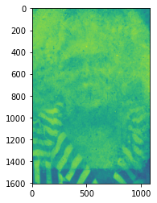
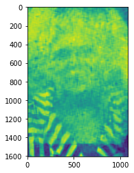

# What is this document?
There was a post on r/estoration, in which a user asked for assistance restoring a photo of a relative who has since passed. The photo is in poor quality:

The purpose of this document is to provide further information into the likely proportions and composition of the photo, such that artistic renderings can be made which are, likely, more accurate to the original.

the original post can be found here:
https://www.reddit.com/r/estoration/comments/12xhle4/my_grandma_has_asked_for_years_to_find_someone_to/

---

# Findings

Using frequency analysis of the image, a few guiding images were extracted which likely will allow artistic renderings to better respect the form and proportions of the original photograph.

by analyzing the difference of the frequency content of different color channels, a few things can be observed:

__1) She was likely wearing earrings__

__2) She likely had a part in her hair, and different proportions than what most of the artistic rendering suggest__

__3) It's likely she was more youthful, in this picture, than many current renderings suggest__

---

# Reference Photos

I will continue to do more analysis, but I think it's likely that, by observing the following photos, fairly realistic renderings will be possible by skilled enough artists:

